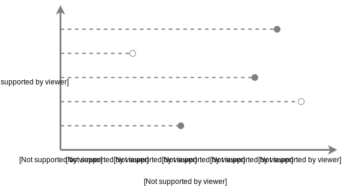

# pycox


[](https://travis-ci.org/havakv/pycox)
[](https://github.com/havakv/pycox/blob/master/LICENSE)
[](https://pycox.readthedocs.io/en/latest/?badge=latest)


Time-to-event prediction with Cox regression in pytorch. 

This is an implementation of \<link to paper\> in pytorch.
In short, we train relative risk models with neural networks to model the event times of future events.




------------------


## Installation

The package only works for python 3.5+.

Before installing pycox, please install [pytorch](https://pytorch.org/). We now only support pytorch 0.4.

In addition, we require the following packages:

- numpy
- scipy
- pandas
- matplotlib
- scikit-learn
- lifelines
- [sklearn-pandas](https://github.com/scikit-learn-contrib/sklearn-pandas)


**Then install pycox from the GitHub source:**

First, clone pycox using `git`:

```sh
git clone https://github.com/havakv/pycox.git
```

 Then, `cd` to the pycox folder and run the install command:
```sh
cd pycox
sudo python setup.py install
```
------------------
## Citation

ADD BIBTEX

------------------

## Credits

This package was created with [Cookiecutter](https://github.com/audreyr/cookiecutter) and the [audreyr/cookiecutter-pypackage](https://github.com/audreyr/cookiecutter-pypackage) project template.

<!-- This package was created with Cookiecutter_ and the `audreyr/cookiecutter-pypackage`_ project template.

.. _Cookiecutter: https://github.com/audreyr/cookiecutter
.. _`audreyr/cookiecutter-pypackage`: https://github.com/audreyr/cookiecutter-pypackage -->
